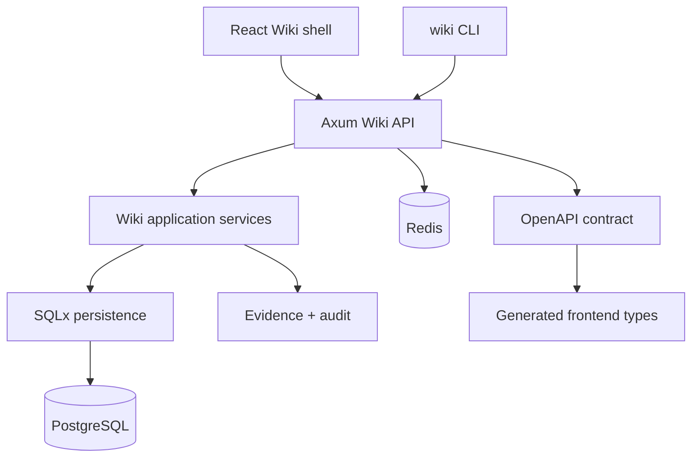

<p align="center">
  
</p>

<p align="center">
  <a href="#features"></a>
  <a href="#stack"></a>
  <a href="#routes"></a>
  <a href="#cli"></a>
  <a href="#architecture"></a>
  <a href="#license"></a>
</p>

<p align="center">
  
  
  
  
  
  
  
  
</p>

---

## 🎯 Позиционирование

**Wiki** — self-hosted SDLC knowledge base для FerrPOINT: spaces, documents, revisions, task dossiers, workflow phases, evidence, attachments, search and audit.

Кодовая база была отделена от `task-tracker`; текущий baseline уже сведен к Wiki API/OpenAPI, CLI surface, frontend shell and SQLx runtime persistence.

## 📌 Snapshot

| Поле | Значение |
|---|---|
| Backend | Rust 2024, Axum, SQLx runtime persistence |
| Data | PostgreSQL 17, Redis 8 |
| Frontend | React 19, Vite, Tailwind CSS |
| API | [openapi/openapi.json](openapi/openapi.json) |
| Ports | Frontend `19877`, backend `3456`, PostgreSQL `3457`, Redis `6379` |
| License | FerrPOINT Proprietary Source-Available Evaluation License v1.0 |

<a name="features"></a>
## ✨ Features

| Feature | Описание |
|---|---|
| Spaces and documents | Requirements, architecture notes, decisions and release materials. |
| Revisions | Document create/view flows and revision-aware backend endpoints. |
| SDLC dossiers | Task and phase dossiers linked to evidence, checks and workflow context. |
| Evidence registry | Links, screenshots, files, PRs, pipeline runs and release checks. |
| Operations | Templates, audit log, users/settings/admin pages and global search. |
| CLI | `wiki` binary for spaces, documents and evidence operations. |
| Documentation | Architecture, operations, threat model, traceability and screenshots. |

<a name="stack"></a>
## 🔧 Core Stack

| Zone | Tech | Роль |
|---|---|---|
| API | Rust + Axum | Wiki MVP routes and public API |
| Persistence | SQLx + PostgreSQL | runtime data and migrations |
| Support services | Redis | cache/background support |
| Frontend | React + Vite + Tailwind | Wiki shell and API-backed MVP pages |
| Contract | OpenAPI | generated frontend types |
| Docs | contracts, security, traceability | source of truth for scope |

## ⚡ Quick Start

```bash
cp .env.example .env
# Replace [CHANGE_ME] values and set WIKI_BOOTSTRAP__ADMIN_EMAIL/PASSWORD
docker compose up -d
curl http://127.0.0.1:3456/api/v1/health
```

Frontend dev:

```bash
cd frontend
pnpm install
pnpm dev
```

<a name="routes"></a>
## 🧭 Frontend Routes

| Route | Назначение |
|---|---|
| `/login`, `/register` | Auth |
| `/` | Dashboard |
| `/spaces`, `/documents/new`, `/documents/:documentId` | Spaces and documents |
| `/tasks`, `/tasks/:taskKey` | Task dossiers |
| `/phases`, `/phases/:phaseId` | Workflow phase dossiers |
| `/evidence`, `/templates`, `/audit-log` | Evidence and operations |
| `/users`, `/settings`, `/admin` | Administration |
| `/search` | Global search |

<a name="cli"></a>
## 🖥️ CLI

```bash
cd backend
cargo build --bin wiki

set WIKI_API_URL=http://localhost:3456/api/v1
set WIKI_TOKEN=<jwt_token>

target\debug\wiki.exe space list
target\debug\wiki.exe doc create --space SDLC --title "Requirements" --from-file requirements.md
```

<a name="architecture"></a>
## 🏗️ Architecture



## 🧱 Границы

- Current baseline is API-backed MVP, not a finished enterprise knowledge platform.
- Before shared deployments, replace all `[CHANGE_ME]` values, set `WIKI_JWT_SECRET`, configure bootstrap admin credentials and review CORS/cookie/TLS settings.
- PostgreSQL and Redis are local/dev defaults; treat exposed ports as intentional deployment choices.

Full current-state cut: [docs/CURRENT_STATE.md](docs/CURRENT_STATE.md).

## 🗂️ Project Map

```text
wiki/
├── backend/     # Rust workspace: public Wiki API, SQLx persistence, CLI
├── frontend/    # React/Vite Wiki shell and API-backed MVP pages
├── cli/         # helper skill notes
├── docs/        # requirements, architecture, contracts, operations, quality
├── openapi/     # Wiki MVP API artifact
├── scripts/     # helper scripts
└── docker-compose.yml
```

## 📚 Документы

- [docs/USER_GUIDE.md](docs/USER_GUIDE.md) — user workflows.
- [docs/DEVELOPMENT_GUIDE.md](docs/DEVELOPMENT_GUIDE.md) — development.
- [docs/OPERATIONS.md](docs/OPERATIONS.md), [docs/TROUBLESHOOTING.md](docs/TROUBLESHOOTING.md) — operations.
- [docs/SECURITY.md](docs/SECURITY.md), [docs/THREAT_MODEL.md](docs/THREAT_MODEL.md) — security.
- [docs/ARCHITECTURE_INDEX.md](docs/ARCHITECTURE_INDEX.md), [docs/ARCHITECTURE.md](docs/ARCHITECTURE.md), [docs/contracts](docs/contracts) — architecture and contracts.
- [docs/API.md](docs/API.md), [docs/DATA_MODEL.md](docs/DATA_MODEL.md), [docs/ENV.md](docs/ENV.md), [docs/CLI.md](docs/CLI.md) — references.
- [docs/TEST_PLAN.md](docs/TEST_PLAN.md), [docs/TRACEABILITY.md](docs/TRACEABILITY.md), [docs/RISK_REGISTER.md](docs/RISK_REGISTER.md) — quality.

Screenshots and recapture notes: [docs/assets/screens/manifest.md](docs/assets/screens/manifest.md).

<a name="license"></a>
## 🔒 License

Proprietary source-available. Not open source.

Viewing/evaluation only.

Commercial, production, resale, redistribution, SaaS/hosting use require written license from FerrPOINT. См. [LICENSE](LICENSE), [NOTICE](NOTICE) и [THIRD_PARTY_NOTICES.md](THIRD_PARTY_NOTICES.md).
