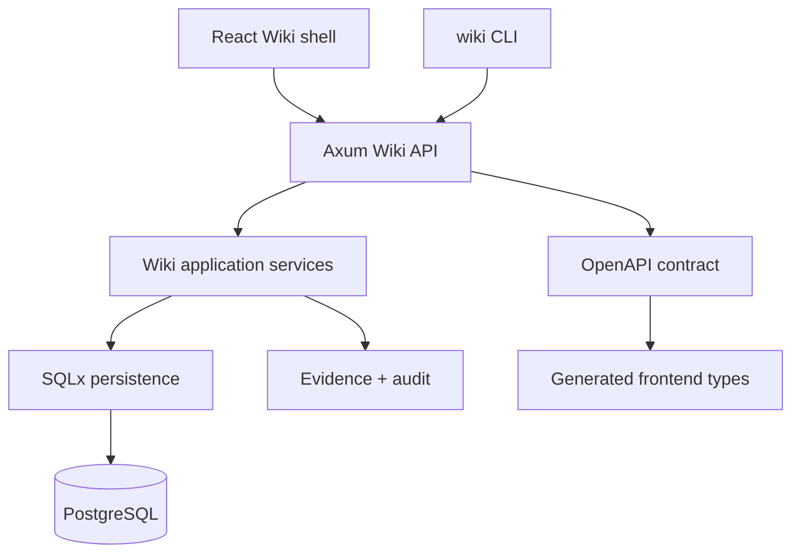

<p align="center">
  
</p>

<p align="center">
  <a href="#features"></a>
  <a href="#stack"></a>
  <a href="#routes"></a>
  <a href="#screenshots"></a>
  <a href="#cli"></a>
  <a href="#architecture"></a>
  <a href="#license"></a>
</p>

<p align="center">
  
  
  
  
  
  
  
</p>

<p align="center">
  
</p>

---

## 🎯 Позиционирование

**Wiki** — self-hosted SDLC knowledge base для FerrPOINT: spaces, documents, revisions, task dossiers, workflow phases, evidence, attachments, search and audit.

The repository is now reduced to the Wiki MVP runtime: public API/OpenAPI, CLI surface, frontend shell and SQLx/PostgreSQL persistence. Copied task-tracker backend modules and old dependencies have been removed from the active workspace.

## 📌 Snapshot

| Поле     | Значение                                                                                      |
| -------- | --------------------------------------------------------------------------------------------- |
| Статус   | MVP baseline: Wiki API/OpenAPI, CLI surface, frontend shell and SQLx persistence are in place |
| Backend  | Rust 2024, Axum, SQLx runtime persistence                                                     |
| Data     | PostgreSQL 17 and filesystem attachment storage                                               |
| Frontend | React 19, Vite, Tailwind CSS                                                                  |
| API      | Canonical Wiki MVP contract in [openapi/openapi.json](openapi/openapi.json)                   |
| Ports    | Frontend `19877`, backend `3456`, PostgreSQL `3457`                                           |
| License  | FerrPOINT Proprietary Source-Available Evaluation License v1.0                                |

<a name="features"></a>

## ✨ Features

| Feature              | Описание                                                                                                        |
| -------------------- | --------------------------------------------------------------------------------------------------------------- |
| Spaces and documents | Spaces and document tree for requirements, architecture notes, decisions and release materials.                 |
| Document lifecycle   | Create/view/edit/publish/archive/move flows, revision-aware backend endpoints and generated frontend API types. |
| SDLC dossiers        | Task and phase dossiers linked to evidence and SDLC workflow context.                                           |
| Evidence registry    | External links and uploaded files attached to documents, tasks or phases.                                       |
| Operations           | Templates, audit log, users/settings/admin pages, global search and API health/readiness probes.                |
| CLI                  | HTTP-only `wiki` binary for the same public API operations as UI.                                               |
| Documentation        | Architecture, operations, threat model, traceability and visual screenshot evidence.                            |

<a name="stack"></a>

## 🔧 Core Stack

| Zone              | Tech                              | Роль                                                  |
| ----------------- | --------------------------------- | ----------------------------------------------------- |
| API               | Rust + Axum                       | Wiki MVP routes and public API                        |
| Persistence       | SQLx + PostgreSQL                 | runtime data and migrations                           |
| Attachment storage | local filesystem                  | uploaded evidence files                               |
| Frontend          | React + Vite + Tailwind           | Wiki shell and API-backed MVP pages                   |
| Contract          | OpenAPI                           | generated frontend types                              |
| Docs              | contracts, security, traceability | source of truth for scope                             |

## ⚡ Quick Start

```bash
cp .env.example .env
# Replace [CHANGE_ME] values and set WIKI_BOOTSTRAP__ADMIN_EMAIL/PASSWORD
docker compose up -d
curl http://127.0.0.1:3456/api/v1/health/ready
```

Frontend dev:

```bash
cd frontend
pnpm install
pnpm dev
```

PostgreSQL API smoke:

```powershell
pwsh -File scripts/postgres-smoke.ps1
```

This starts the disposable test database from [backend/docker-compose.test.yml](backend/docker-compose.test.yml) and runs the env-gated `wiki_postgres_` API tests, including persistence, membership revocation and FTS index-plan evidence.

If Docker Desktop is unavailable but WSL has a local PostgreSQL service, run the same smoke against an isolated temporary WSL database:

```powershell
pwsh -File scripts/postgres-smoke-wsl.ps1
```

<a name="routes"></a>

## 🧭 Frontend Routes

| Route                                                 | Назначение              |
| ----------------------------------------------------- | ----------------------- |
| `/login`, `/register`                                 | Auth                    |
| `/`                                                   | Dashboard               |
| `/spaces`, `/documents/new`, `/documents/:documentId` | Spaces and documents    |
| `/tasks`, `/tasks/:taskKey`                           | Task dossiers           |
| `/phases`, `/phases/:phaseId`                         | Workflow phase dossiers |
| `/evidence`, `/templates`, `/audit-log`               | Evidence and operations |
| `/users`, `/settings`, `/admin`                       | Administration          |
| `/search`                                             | Global search           |

Operational `/api/v1/health` and `/api/v1/health/ready` probes are API-only and do not have frontend screenshots.

<a name="screenshots"></a>

## 🖼️ Screenshots

Recapture parameters and full evidence are tracked in [docs/assets/screens/manifest.md](docs/assets/screens/manifest.md).

### Desktop Gallery

| Route | Preview |
| ----- | ------- |
| `/login` |  |
| `/register` |  |
| `/` |  |
| `/spaces` |  |
| `/documents/new` |  |
| `/documents/:documentId` |  |
| `/tasks` |  |
| `/tasks/:taskKey` |  |
| `/phases` |  |
| `/phases/:phaseId` |  |
| `/evidence` |  |
| `/templates` |  |
| `/audit-log` |  |
| `/users` |  |
| `/settings` |  |
| `/search` |  |
| `/admin` |  |

### Mobile Smoke

| Route | Preview |
| ----- | ------- |
| `/` |  |
| `/spaces` |  |
| `/documents/:documentId` |  |
| `/tasks/:taskKey` |  |
| `/search` |  |

### Files

| Route                    | Screenshot                                                                  |
| ------------------------ | --------------------------------------------------------------------------- |
| `/login`                 | [01-login.png](docs/screenshots/01-login.png)                               |
| `/register`              | [02-register.png](docs/screenshots/02-register.png)                         |
| `/`                      | [03-dashboard.png](docs/screenshots/03-dashboard.png)                       |
| `/spaces`                | [04-spaces.png](docs/screenshots/04-spaces.png)                             |
| `/documents/new`         | [05-document-compose.png](docs/screenshots/05-document-compose.png)         |
| `/documents/:documentId` | [06-document-view.png](docs/screenshots/06-document-view.png)               |
| `/tasks`                 | [07-task-dossiers.png](docs/screenshots/07-task-dossiers.png)               |
| `/tasks/:taskKey`        | [08-task-dossier-detail.png](docs/screenshots/08-task-dossier-detail.png)   |
| `/phases`                | [09-phase-dossiers.png](docs/screenshots/09-phase-dossiers.png)             |
| `/phases/:phaseId`       | [10-phase-dossier-detail.png](docs/screenshots/10-phase-dossier-detail.png) |
| `/evidence`              | [11-evidence.png](docs/screenshots/11-evidence.png)                         |
| `/templates`             | [12-templates.png](docs/screenshots/12-templates.png)                       |
| `/audit-log`             | [13-audit-log.png](docs/screenshots/13-audit-log.png)                       |
| `/users`                 | [14-users.png](docs/screenshots/14-users.png)                               |
| `/settings`              | [15-settings.png](docs/screenshots/15-settings.png)                         |
| `/search`                | [16-search.png](docs/screenshots/16-search.png)                             |
| `/admin`                 | [17-admin.png](docs/screenshots/17-admin.png)                               |

Mobile smoke: [dashboard](docs/screenshots/m-dashboard.png), [spaces](docs/screenshots/m-spaces.png), [document](docs/screenshots/m-document-view.png), [task](docs/screenshots/m-task-dossier.png), [search](docs/screenshots/m-search.png).

<a name="cli"></a>

## 🖥️ CLI

```bash
cd backend
cargo build --bin wiki

set WIKI_API_URL=http://localhost:3456/api/v1
set WIKI_TOKEN=<jwt_token>

target\debug\wiki.exe space list
target\debug\wiki.exe user list
target\debug\wiki.exe doc create --space SDLC --title "Requirements" --from-file requirements.md
target\debug\wiki.exe space member-set SDLC --user <user-id> --role editor
target\debug\wiki.exe attachment download <attachment-id> --out artifact.bin
target\debug\wiki.exe audit list --limit 25
target\debug\wiki.exe settings get
```

<a name="architecture"></a>

## 🏗️ Architecture



## 🧱 Границы

- Current baseline is API-backed MVP, not a finished enterprise knowledge platform.
- Reports, notifications, webhooks, import/export bundles, OCR and real-time collaboration are deferred.
- Before shared deployments, replace all `[CHANGE_ME]` values, set `WIKI_JWT_SECRET`, configure bootstrap admin credentials and review CORS/cookie/TLS settings.
- PostgreSQL is the local/dev data service; treat exposed ports as intentional deployment choices.

Full current-state cut: [docs/CURRENT_STATE.md](docs/CURRENT_STATE.md).

## 🗂️ Project Map

```text
wiki/
├── backend/     # Rust workspace: public Wiki API, SQLx persistence, CLI
├── frontend/    # React/Vite Wiki shell and API-backed MVP pages
├── cli/         # helper skill notes
├── docs/        # requirements, architecture, contracts, operations, quality
├── openapi/     # Wiki MVP API artifact
├── scripts/     # helper scripts
└── docker-compose.yml
```

## 📚 Документы

- [docs/USER_GUIDE.md](docs/USER_GUIDE.md) — user workflows.
- [docs/MVP_READINESS.md](docs/MVP_READINESS.md) — 100% readiness gate before main development.
- [docs/DEVELOPMENT_GUIDE.md](docs/DEVELOPMENT_GUIDE.md) — development.
- [docs/OPERATIONS.md](docs/OPERATIONS.md), [docs/TROUBLESHOOTING.md](docs/TROUBLESHOOTING.md) — operations.
- [docs/SECURITY.md](docs/SECURITY.md), [docs/THREAT_MODEL.md](docs/THREAT_MODEL.md) — security.
- [docs/ARCHITECTURE_INDEX.md](docs/ARCHITECTURE_INDEX.md), [docs/ARCHITECTURE.md](docs/ARCHITECTURE.md), [docs/contracts](docs/contracts) — architecture and contracts.
- [docs/API.md](docs/API.md), [docs/DATA_MODEL.md](docs/DATA_MODEL.md), [docs/ENV.md](docs/ENV.md), [docs/CLI.md](docs/CLI.md) — references.
- [docs/TEST_PLAN.md](docs/TEST_PLAN.md), [docs/TRACEABILITY.md](docs/TRACEABILITY.md), [docs/RISK_REGISTER.md](docs/RISK_REGISTER.md) — quality.

Screenshots and recapture notes: [docs/assets/screens/manifest.md](docs/assets/screens/manifest.md).

<a name="license"></a>

## 🔒 License

Proprietary source-available. Not open source.

Viewing/evaluation only.

Commercial, production, resale, redistribution, SaaS/hosting use require written license from FerrPOINT. См. [LICENSE](LICENSE), [NOTICE](NOTICE) и [THIRD_PARTY_NOTICES.md](THIRD_PARTY_NOTICES.md).

<p align="center">
  
</p>
