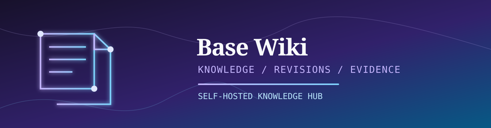
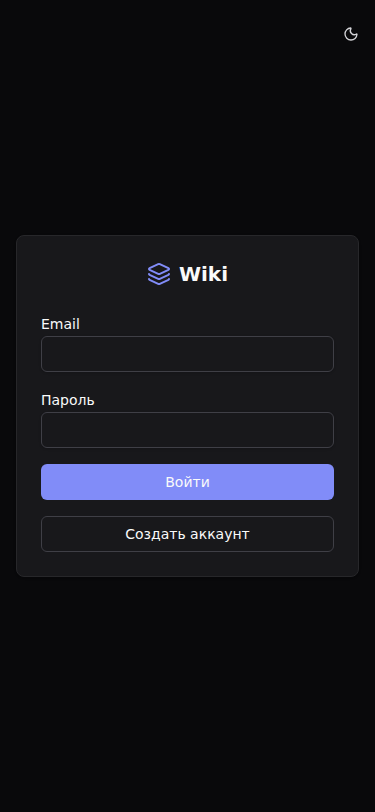
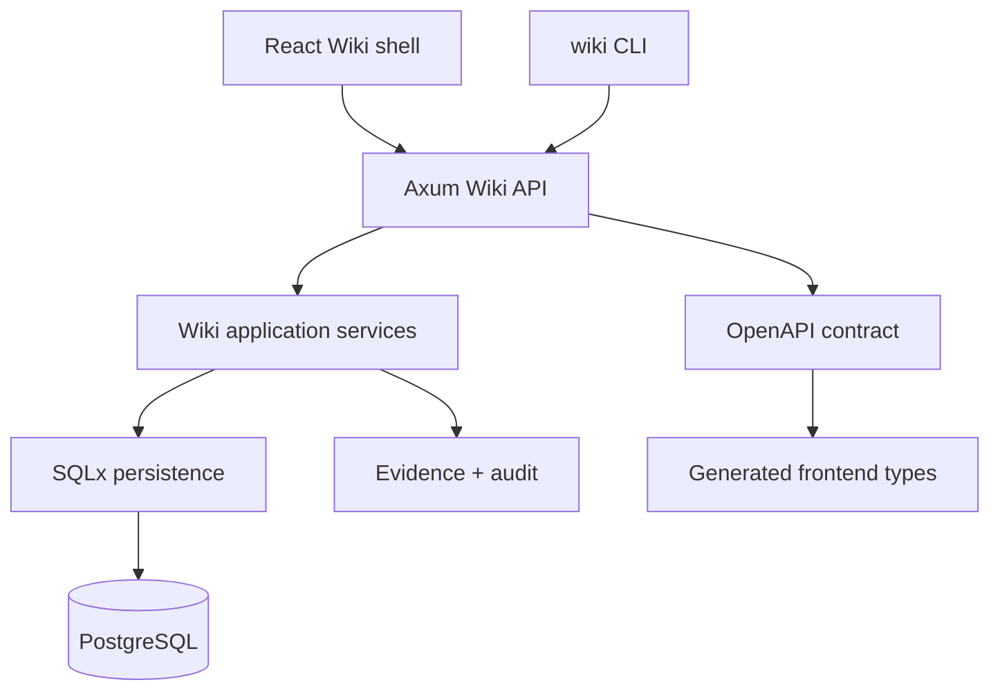

<p align="center">
  
</p>

<p align="center">
  <a href="#overview"></a>
  <a href="#capabilities"></a>
  <a href="#routes"></a>
  <a href="#quick-start"></a>
  <a href="#visual-proof"></a>
  <a href="#cli"></a>
  <a href="#quality"></a>
</p>

<p align="center">
  
  
  
  
  
  
  
</p>

---

## 🎯 Позиционирование

**Wiki** — self-hosted knowledge base платформы Base для FerrPOINT: spaces, documents, revisions, task dossiers, workflow phases, evidence, attachments, search и audit.

Репозиторий сокращён до Wiki MVP runtime: public API/OpenAPI, CLI surface, frontend shell и SQLx/PostgreSQL persistence. Скопированные task-tracker backend-модули и старые зависимости удалены из активного workspace.

<a name="overview"></a>

## 📌 Snapshot

| Поле | Значение |
|---|---|
| Статус | MVP baseline: Wiki API/OpenAPI, CLI surface, frontend shell и SQLx persistence на месте |
| Backend | Rust 2024, Axum, SQLx runtime persistence |
| Data | PostgreSQL 17 и filesystem attachment storage |
| Frontend | React 19, Vite, Tailwind CSS |
| API | Canonical Wiki MVP contract: [openapi/openapi.json](openapi/openapi.json) |
| Порты | repository-local: frontend `19877`, backend `3456`, PostgreSQL `3457`; Base umbrella: frontend `7732`, API `7731`, PostgreSQL loopback `7733` |
| License | FerrPOINT Proprietary Source-Available Evaluation License v1.0 |

<a name="capabilities"></a>

## ✨ Возможности

| Feature | Описание |
|---|---|
| Spaces and documents | Spaces и document tree для requirements, architecture notes, decisions и release materials. |
| Document lifecycle | Create/view/edit/publish/archive/move flows, revision-aware backend endpoints и generated frontend API types. |
| Base dossiers | Task и phase dossiers, связанные с evidence и workflow context. |
| Evidence registry | External links и uploaded files, прикреплённые к documents, tasks или phases. |
| Operations | Templates, audit log, users/settings/admin pages, global search и API health/readiness probes. |
| CLI | HTTP-only `wiki` binary для тех же public API операций, что и UI. |
| Documentation | Architecture, operations, threat model, traceability и visual screenshot evidence. |

## 🔧 Стек

| Zone | Tech | Роль |
|---|---|---|
| API | Rust + Axum | Wiki MVP routes и public API |
| Persistence | SQLx + PostgreSQL | runtime data и migrations |
| Attachment storage | local filesystem | uploaded evidence files |
| Frontend | React + Vite + Tailwind | Wiki shell и API-backed MVP pages |
| Contract | OpenAPI | generated frontend types |
| Docs | contracts, security, traceability | source of truth для scope |

<a name="quick-start"></a>

## ⚡ Быстрый старт

```bash
cp .env.example .env
# Заменить [CHANGE_ME] значения и задать WIKI_BOOTSTRAP__ADMIN_EMAIL/PASSWORD
docker compose up --build -d
curl -fsS http://127.0.0.1:3456/api/v1/health
curl -fsS http://127.0.0.1:3456/api/v1/health/ready
```

Frontend dev:

```bash
cd frontend
pnpm install
pnpm dev
```

PostgreSQL API smoke (disposable test DB + env-gated `wiki_postgres_` API tests, включая persistence, membership revocation и FTS index-plan evidence):

```powershell
pwsh -File scripts/postgres-smoke.ps1
```

Если Docker Desktop недоступен, но в WSL есть локальный PostgreSQL — тот же smoke против изолированной временной БД:

```powershell
pwsh -File scripts/postgres-smoke-wsl.ps1
```

Backup/restore drill на том же Windows/WSL fallback-пути:

```powershell
pwsh -File scripts/backup-restore-smoke-wsl.ps1
```

<a name="routes"></a>

## 🧭 Фронтенд-роуты

| Route | Назначение |
|---|---|
| `/login`, `/register` | Auth |
| `/` | Dashboard |
| `/spaces`, `/documents/new`, `/documents/:documentId` | Spaces и documents |
| `/tasks`, `/tasks/:taskKey` | Task dossiers |
| `/phases`, `/phases/:phaseId` | Workflow phase dossiers |
| `/evidence`, `/templates`, `/audit-log` | Evidence и operations |
| `/users`, `/settings`, `/admin` | Administration |
| `/search` | Global search |

Операционные probe `/api/v1/health` и `/api/v1/health/ready` — API-only, без frontend-скриншотов.

<a name="visual-proof"></a>

## 🖼️ Визуальные доказательства

Скриншоты — реальные страницы продукта. Desktop full-page, mobile `375x812`. Полный реестр и параметры пересъёмки: [docs/assets/screens/manifest.md](docs/assets/screens/manifest.md).

### Вход


### Регистрация


### Дашборд


### Пространства


### Создание документа


### Просмотр документа


### Task-досье


### Карточка task-досье


### Phase-досье


### Карточка phase-досье


### Evidence


### Шаблоны


### Журнал аудита


### Пользователи


### Настройки


### Поиск


### Администрирование


### Мобильный интерфейс (375×812)

|   |   |
| :---: | :---: |
|  |  |
|  |  |
|  |  |

<a name="cli"></a>

## 🖥️ CLI

```bash
cd backend
cargo build --bin wiki

export WIKI_API_URL=http://localhost:3456/api/v1
export WIKI_TOKEN=<jwt_token>

./target/debug/wiki space list
./target/debug/wiki user list
./target/debug/wiki doc create --space BASE --title "Requirements" --from-file requirements.md
./target/debug/wiki space member-set BASE --user <user-id> --role editor
./target/debug/wiki attachment download <attachment-id> --out artifact.bin
./target/debug/wiki audit list --limit 25
./target/debug/wiki settings get
```

## 🏗️ Архитектура



<a name="safety"></a>

## 🧱 Границы

- Текущий baseline — API-backed MVP, не готовая enterprise knowledge platform.
- Reports, notifications, webhooks, import/export bundles, OCR и real-time collaboration отложены.
- Перед shared deployments замените все `[CHANGE_ME]`, задайте `WIKI_ENVIRONMENT=production`, `WIKI_JWT_SECRET`, bootstrap-admin credentials и проверьте CORS/cookie/TLS.
- Опубликованный Markdown рендерится в sanitized HTML; имена и storage-ключи вложений валидируются.
- Production startup отклоняет слабую auth-конфигурацию, wildcard/non-HTTPS CORS, insecure refresh cookies и пустой database URL.

Полный current-state срез: [docs/CURRENT_STATE.md](docs/CURRENT_STATE.md).

<a name="quality"></a>

## 🛡️ Качество и проверки

| Проверка | Команда |
|---|---|
| README contract tests | `python3 -m unittest scripts.tests.test_verify_readme -v` |
| README assets и anchors | `python3 scripts/verify_readme.py` |
| Backend | `cd backend && cargo fmt --all -- --check && cargo clippy --workspace --all-targets -- -D warnings && cargo test --workspace -- --test-threads=1` |
| Frontend | `cd frontend && pnpm openapi:check && pnpm typecheck && pnpm test -- --run && pnpm lint && pnpm build` |
| Browser route smoke | `cd frontend && pnpm test:e2e -- --project=chromium` |
| Compose contract | `docker compose config -q` |
| Runtime probes | `curl -fsS http://127.0.0.1:3456/api/v1/health` и `.../health/ready` |

GitHub Actions прогоняет backend, OpenAPI, migration, coverage, dependency-audit, frontend и browser-E2E gates; независимый README job не пускает в `main` битые anchors, отсутствующее reviewed evidence и утечки путей/плейсхолдеров.

## 🗂️ Карта проекта

```text
wiki/
├── backend/     # Rust workspace: public Wiki API, SQLx persistence, CLI
├── frontend/    # React/Vite Wiki shell и API-backed MVP pages
├── cli/         # helper skill notes
├── docs/        # requirements, architecture, contracts, operations, quality
├── openapi/     # Wiki MVP API artifact
├── scripts/     # helper scripts
└── docker-compose.yml
```

## 📚 Документы

- [docs/USER_GUIDE.md](docs/USER_GUIDE.md) — пользовательские сценарии.
- [docs/MVP_READINESS.md](docs/MVP_READINESS.md) — 100% readiness gate перед main development.
- [docs/DEVELOPMENT_GUIDE.md](docs/DEVELOPMENT_GUIDE.md) — разработка.
- [docs/OPERATIONS.md](docs/OPERATIONS.md), [docs/TROUBLESHOOTING.md](docs/TROUBLESHOOTING.md) — эксплуатация.
- [docs/SECURITY.md](docs/SECURITY.md), [docs/THREAT_MODEL.md](docs/THREAT_MODEL.md) — безопасность.
- [docs/ARCHITECTURE_INDEX.md](docs/ARCHITECTURE_INDEX.md), [docs/ARCHITECTURE.md](docs/ARCHITECTURE.md), [docs/contracts](docs/contracts) — архитектура и контракты.
- [docs/API.md](docs/API.md), [docs/DATA_MODEL.md](docs/DATA_MODEL.md), [docs/ENV.md](docs/ENV.md), [docs/CLI.md](docs/CLI.md) — справочники.
- [docs/TEST_PLAN.md](docs/TEST_PLAN.md), [docs/TRACEABILITY.md](docs/TRACEABILITY.md), [docs/RISK_REGISTER.md](docs/RISK_REGISTER.md) — качество.

Скриншоты и параметры пересъёмки: [docs/assets/screens/manifest.md](docs/assets/screens/manifest.md).

<a name="license"></a>

## 🔒 Лицензия

Proprietary source-available. Not open source. Viewing/evaluation only.

Commercial, production, resale, redistribution, SaaS/hosting use require written license from FerrPOINT. См. [LICENSE](LICENSE), [NOTICE](NOTICE) и [THIRD_PARTY_NOTICES.md](THIRD_PARTY_NOTICES.md).
