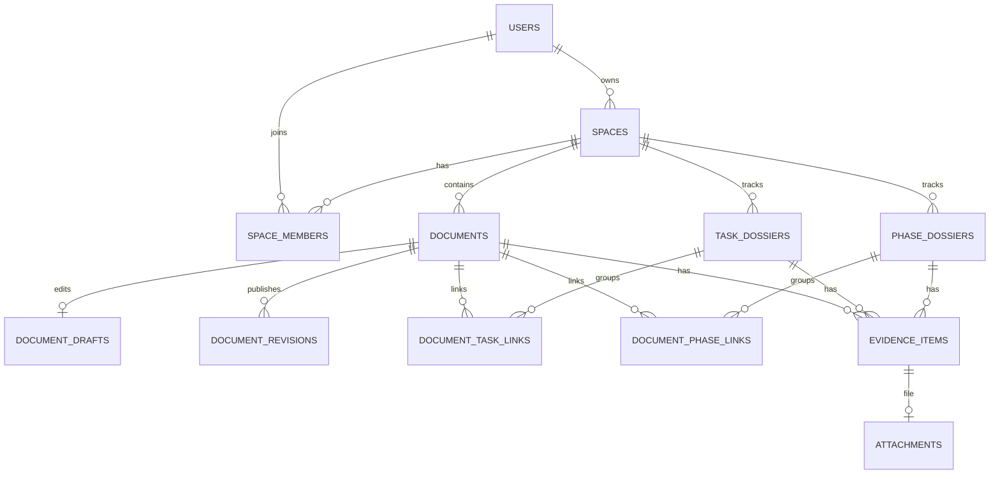

# Дата-модель Wiki

## 1. Назначение

Wiki хранит документы, связанные с задачами SDLC и фазами workflow. MVP-модель поддерживает базовый Wiki-опыт: пользователи, spaces, дерево страниц, версии, поиск, вложения, evidence и права.

Текущие миграции ещё унаследованы из исходного `task-tracker`. Этот документ описывает целевую минимальную модель, на которую нужно заменить старую схему.

## 2. Общие правила

- Все идентификаторы - UUIDv7.
- Основные таблицы имеют `created_at`, `updated_at`, а для архивирования - `archived_at`.
- Текст документов хранится в Markdown как исходник и в sanitized HTML как производное представление.
- Опубликованные ревизии неизменяемы.
- Связи с задачами и фазами хранятся как внешние ключи-строки: `task_key`, `phase_key`.
- Удаление в MVP реализуется как archive/soft-delete.

## 3. Tables

### users

| Поле | Тип | Описание |
|---|---|---|
| `id` | uuid | PK |
| `email` | text | unique |
| `display_name` | text | Отображаемое имя |
| `password_hash` | text | Argon2id |
| `global_role` | text | `admin`, `user` |
| `is_active` | bool | Активная учётная запись |
| `created_at` | timestamptz | Создание |
| `updated_at` | timestamptz | Обновление |

### spaces

| Поле | Тип | Описание |
|---|---|---|
| `id` | uuid | PK |
| `key` | text | unique, короткий ключ |
| `name` | text | Название |
| `description` | text | Описание |
| `owner_id` | uuid | FK users |
| `archived_at` | timestamptz nullable | Архивирование |
| `created_at` | timestamptz | Создание |
| `updated_at` | timestamptz | Обновление |

### space_members

| Поле | Тип | Описание |
|---|---|---|
| `space_id` | uuid | FK spaces |
| `user_id` | uuid | FK users |
| `role` | text | `admin`, `editor`, `viewer` |
| `joined_at` | timestamptz | Дата добавления |

Primary key: `(space_id, user_id)`.

### documents

Документ как стабильная страница в дереве space.

| Поле | Тип | Описание |
|---|---|---|
| `id` | uuid | PK |
| `space_id` | uuid | FK spaces |
| `parent_id` | uuid nullable | Родительский документ |
| `slug` | text | URL-safe имя внутри parent |
| `title` | text | Название |
| `document_type` | text | `page`, `requirements`, `research_note`, `implementation_note`, `test_plan`, `release_note` |
| `status` | text | `draft`, `published`, `archived` |
| `current_revision_id` | uuid nullable | FK document_revisions |
| `owner_id` | uuid | FK users |
| `created_at` | timestamptz | Создание |
| `updated_at` | timestamptz | Обновление |
| `archived_at` | timestamptz nullable | Архивирование |

Unique: `(space_id, parent_id, slug)`.

### document_drafts

| Поле | Тип | Описание |
|---|---|---|
| `document_id` | uuid | PK, FK documents |
| `author_id` | uuid | Последний редактор |
| `content_markdown` | text | Текущий черновик |
| `base_revision_id` | uuid nullable | От какой ревизии начато редактирование |
| `updated_at` | timestamptz | Последнее изменение |

### document_revisions

Неизменяемая история опубликованного содержимого.

| Поле | Тип | Описание |
|---|---|---|
| `id` | uuid | PK |
| `document_id` | uuid | FK documents |
| `version` | int | Номер версии |
| `title` | text | Заголовок на момент публикации |
| `content_markdown` | text | Исходный Markdown |
| `content_html` | text | Sanitized HTML |
| `content_text` | text | Plain text для поиска |
| `content_checksum` | text | SHA-256 исходника |
| `summary` | text nullable | Комментарий к версии |
| `author_id` | uuid | FK users |
| `published_at` | timestamptz | Время публикации |

Unique: `(document_id, version)`.

### task_dossiers

Срез документов/evidence по внешнему ключу задачи.

| Поле | Тип | Описание |
|---|---|---|
| `id` | uuid | PK |
| `space_id` | uuid | FK spaces |
| `task_key` | text | Например `SDLC-42` |
| `title_snapshot` | text nullable | Название задачи, если известно |
| `external_url` | text nullable | Ссылка на задачу |
| `created_at` | timestamptz | Создание |
| `updated_at` | timestamptz | Обновление |

Unique: `(space_id, task_key)`.

### phase_dossiers

Срез документов/evidence по phase key.

| Поле | Тип | Описание |
|---|---|---|
| `id` | uuid | PK |
| `space_id` | uuid | FK spaces |
| `phase_key` | text | Например `requirements`, `implementation`, `testing`, `release` |
| `phase_name` | text nullable | Человеческое имя |
| `created_at` | timestamptz | Создание |
| `updated_at` | timestamptz | Обновление |

Unique: `(space_id, phase_key)`.

### document_task_links

| Поле | Тип | Описание |
|---|---|---|
| `document_id` | uuid | FK documents |
| `task_dossier_id` | uuid | FK task_dossiers |
| `created_by` | uuid | FK users |
| `created_at` | timestamptz | Создание |

Primary key: `(document_id, task_dossier_id)`.

### document_phase_links

| Поле | Тип | Описание |
|---|---|---|
| `document_id` | uuid | FK documents |
| `phase_dossier_id` | uuid | FK phase_dossiers |
| `created_by` | uuid | FK users |
| `created_at` | timestamptz | Создание |

Primary key: `(document_id, phase_dossier_id)`.

### evidence_items

URL или файл, связанный с документом, задачей или фазой.

| Поле | Тип | Описание |
|---|---|---|
| `id` | uuid | PK |
| `space_id` | uuid | FK spaces |
| `document_id` | uuid nullable | FK documents |
| `task_dossier_id` | uuid nullable | FK task_dossiers |
| `phase_dossier_id` | uuid nullable | FK phase_dossiers |
| `kind` | text | `url`, `file` |
| `title` | text | Название evidence |
| `url` | text nullable | Внешняя ссылка для URL evidence |
| `attachment_id` | uuid nullable | FK attachments for file evidence |
| `checksum` | text nullable | Контрольная сумма файла или payload |
| `metadata` | jsonb | Небольшие дополнительные поля |
| `created_by` | uuid | FK users |
| `created_at` | timestamptz | Создание |

Constraint: минимум одно из `document_id`, `task_dossier_id`, `phase_dossier_id` заполнено.

### attachments

| Поле | Тип | Описание |
|---|---|---|
| `id` | uuid | PK |
| `space_id` | uuid | FK spaces |
| `owner_entity_type` | text | `document`, `revision`, `evidence` |
| `owner_entity_id` | uuid | ID владельца |
| `file_name` | text | Исходное имя |
| `content_type` | text | MIME |
| `size_bytes` | bigint | Размер |
| `storage_key` | text | Ключ в storage adapter |
| `checksum` | text | SHA-256 |
| `uploaded_by` | uuid | FK users |
| `uploaded_at` | timestamptz | Время загрузки |

### document_templates

| Поле | Тип | Описание |
|---|---|---|
| `id` | uuid | PK |
| `space_id` | uuid nullable | Локальный или глобальный шаблон |
| `name` | text | Название |
| `kind` | text | `requirements`, `research_note`, `implementation_note`, `test_plan`, `release_note` |
| `content_markdown` | text | Тело шаблона |
| `is_active` | bool | Доступен для выбора |
| `created_at` | timestamptz | Создание |
| `updated_at` | timestamptz | Обновление |

### audit_log

| Поле | Тип | Описание |
|---|---|---|
| `id` | uuid | PK |
| `actor_id` | uuid nullable | FK users |
| `action` | text | Например `document.publish` |
| `entity_type` | text | Тип объекта |
| `entity_id` | uuid | ID объекта |
| `diff` | jsonb nullable | Старое/новое значение без секретов |
| `request_id` | text | Корреляция |
| `created_at` | timestamptz | Время |

## 4. Search

MVP search строится на PostgreSQL full-text search.

Индексируются:

- published document title;
- published revision plain text;
- document type;
- linked task key;
- linked phase key.

Минимальный `tsvector`:

```sql
ALTER TABLE document_revisions ADD COLUMN search_vector tsvector;

CREATE INDEX document_revisions_search_idx
  ON document_revisions USING GIN (search_vector);
```

## 5. Mermaid



## 6. Seed Data

При первом запуске создаются:

1. System admin из env `WIKI_ADMIN_EMAIL` / `WIKI_ADMIN_PASSWORD`.
2. Space `ENG` для инженерной документации.
3. Базовые шаблоны: requirements, research note, implementation note, test plan, release note.

## 7. References

- `docs/DOMAIN_MODEL.md`
- `docs/API.md`
- `docs/DATABASE_INDEXES.md`
