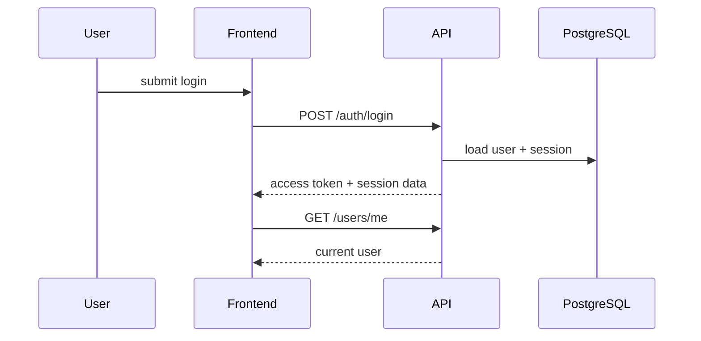

# Sequence - Auth Session

## Rules

- Access token is short-lived.
- Refresh token is stored in httpOnly cookie when possible; local development can use the documented fallback.
- Failed refresh clears local auth state and returns user to `/login`.
- User profile is cached with a short stale time and invalidated after login/register/logout.

## Failure Modes

| Failure | Handling |
|---|---|
| Wrong credentials | `401` with generic error |
| Inactive user | `403`, audit security event |
| Expired access token | refresh once, then retry original request |
| Refresh failure | clear auth and redirect to login |

## Acceptance Criteria

- Login and register set auth state.
- Protected routes redirect anonymous users.
- Logout clears query cache and local refresh token.
- Current user role controls admin navigation.
