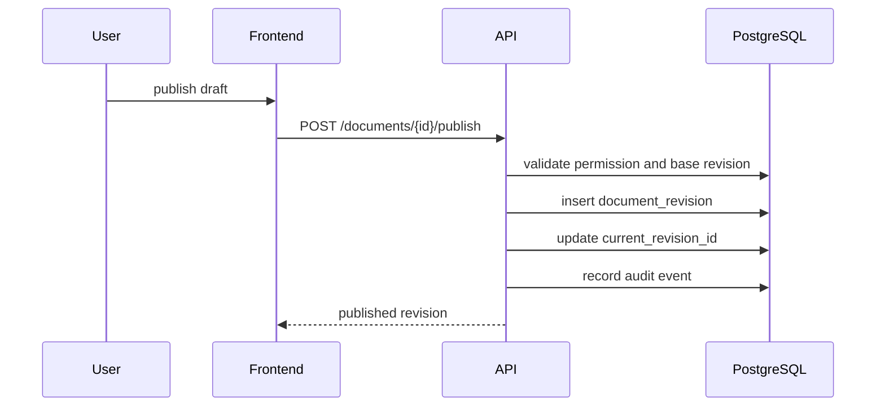

# Sequence - Document Publish

## Rules

- Publishing requires editor permission in the space.
- Base revision is checked to prevent stale overwrite.
- Published revision content is immutable.
- Restoring an older revision creates a new revision.
- Search index and audit data are updated as part of the publish flow.

## Failure Modes

| Failure | Handling |
|---|---|
| Missing permission | `403 permission_denied` |
| Stale draft | `409 revision_conflict` |
| Invalid Markdown metadata | `422 validation_failed` |
| Search index update failed | publish rolls back or returns explicit retryable error |

## Acceptance Criteria

- Document current revision changes atomically with revision insert.
- Audit log records actor, document id and revision id.
- Search can find the new revision after publish completes.
