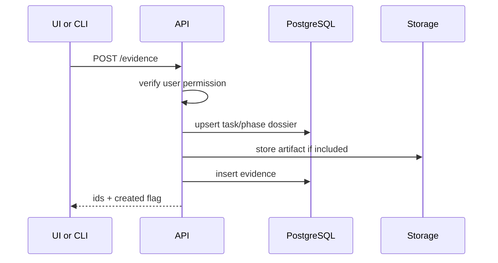

# Sequence - Evidence Ingest

## Rules

- Evidence write must be authenticated.
- Idempotency key is required when the client retries create requests.
- Evidence belongs to a space, task dossier or phase dossier.
- Binary payloads are stored in object storage; metadata stays in PostgreSQL.
- Checksums are recorded for uploaded files.

## Failure Modes

| Failure | Handling |
|---|---|
| Duplicate create | Return existing evidence id |
| Missing task mapping | Store unassigned evidence or reject by policy |
| Oversized file | Reject before persistence |
| Storage failure | Roll back metadata transaction |

## Acceptance Criteria

- URL and file evidence are visible in evidence registry.
- Materials can attach to task or phase pages.
- Retry does not create duplicate evidence.
