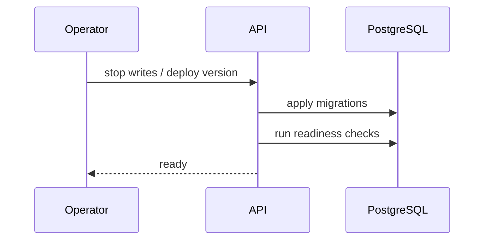

# Sequence - Migration Deploy

## Deployment Steps

1. Announce maintenance window when migration is not fully online.
2. Stop background workers or put them into drain mode.
3. Apply database migrations.
4. Start API in compatibility mode if required.
5. Run readiness checks for schema, storage and queues.
6. Start workers and verify queue lag.
7. Run smoke checks for auth, documents, evidence and search.

## Rollback Rules

- Rollback plan is required for destructive changes.
- Irreversible migrations must be called out in release notes.
- Object storage changes require separate restore validation.
- OpenAPI/client changes are deployed only after backend compatibility is verified.

## Acceptance Criteria

- Fresh database and upgraded database both pass migration checks.
- `CURRENT_STATE.md` reflects capability status after deploy.
- Operators have backup location and restore command.
