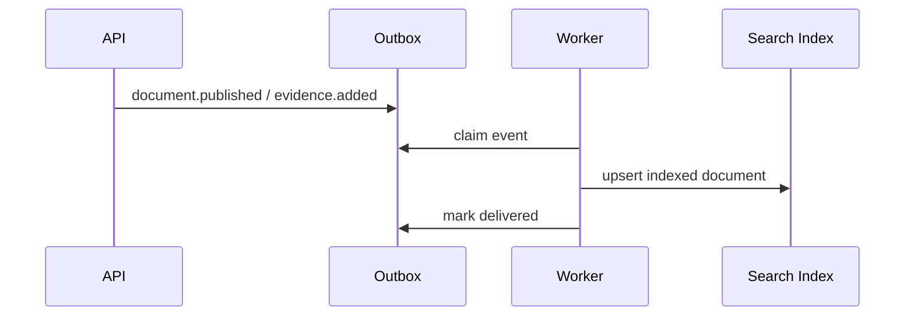

# Sequence - Search Indexing

## Indexed Objects

- document title, body, tags and current revision metadata;
- task dossier key, title snapshot and linked documents;
- phase dossier name and completeness state;
- evidence title, kind, source refs and safe metadata.

## Rules

- Search results are filtered by permissions at query time.
- Secret values and unsafe HTML are never indexed.
- Published revision id is part of the indexed record.
- Indexing is retryable and can be rebuilt from PostgreSQL.

## Failure Modes

| Failure | Handling |
|---|---|
| Worker down | Outbox lag grows and alert fires |
| Stale index | Result shows latest permitted DB metadata after detail load |
| Permission mismatch | Security bug; block release until fixed |

## Acceptance Criteria

- Publishing a document queues an index update.
- Evidence ingest queues an index update.
- Reindex command can rebuild all searchable records.
