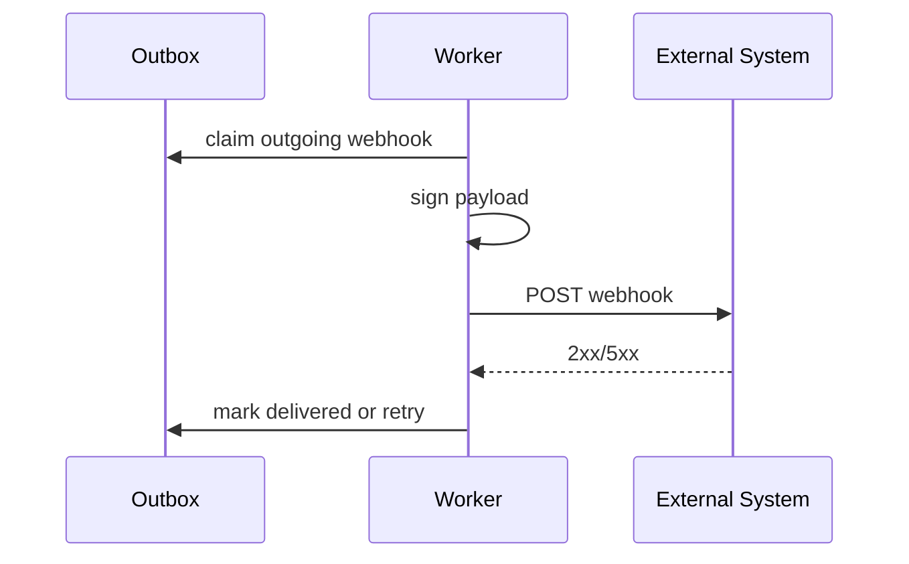

# Sequence - Webhook Delivery

Webhook delivery is deferred reference material. It is not part of the Wiki MVP frontend, API or runtime.

## Rules

- Payload is created from committed domain event.
- Delivery includes event id, timestamp and HMAC signature when configured.
- Retry uses exponential backoff and does not reorder events for the same aggregate when ordering is required.
- Delivery response body is truncated and redacted before persistence.

## Failure Modes

| Failure | Handling |
|---|---|
| 2xx | Mark delivered |
| 4xx | Mark failed unless policy says retry |
| 5xx/network | Retry until max attempts |
| Signature config missing | Do not deliver when receiver requires signing |

## Future Acceptance Criteria

- Delivery attempts are visible in a future operator view or audit export.
- Operators can replay safe failed delivery when webhook delivery is approved.
- Duplicate delivery keeps the same event id.
