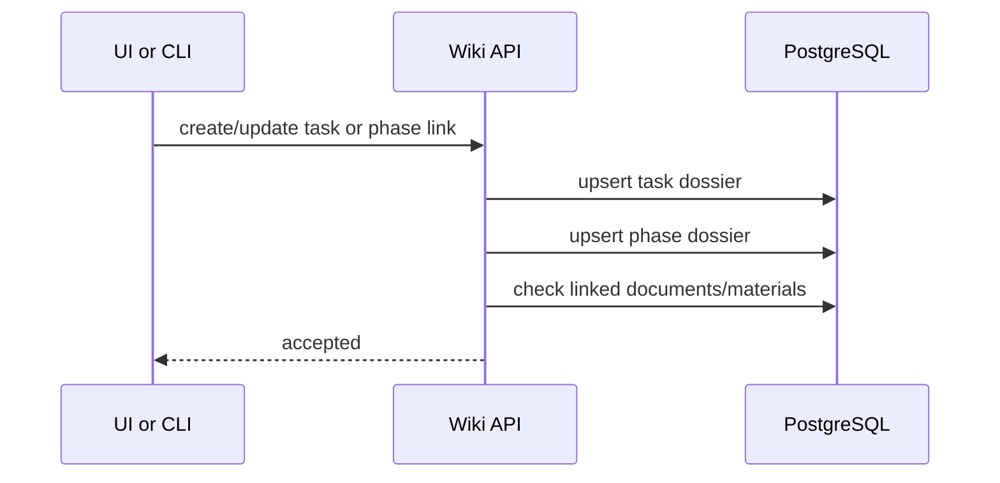

# Sequence - Workflow Phase Sync

## Rules

- Wiki stores task and phase snapshots from API/CLI clients.
- Wiki tracks documentation completeness from linked documents and materials.
- Completed phase can still receive additional materials, but the original completion snapshot stays auditable.

## Failure Modes

| Failure | Handling |
|---|---|
| Unknown phase | Create pending mapping or reject by project policy |
| Missing task dossier | Upsert task page from submitted snapshot |
| Missing materials | Accept update and show dashboard gap |
| Duplicate phase update | Return existing phase page id |

## Acceptance Criteria

- Phase page exists after the task/phase link is created.
- Missing required documents appear on the dashboard.
- Phase page links back to task page and related materials.
