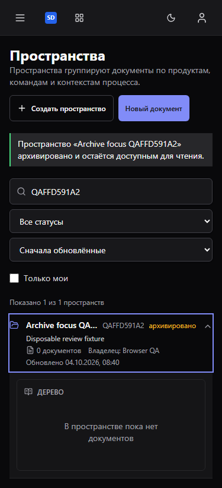
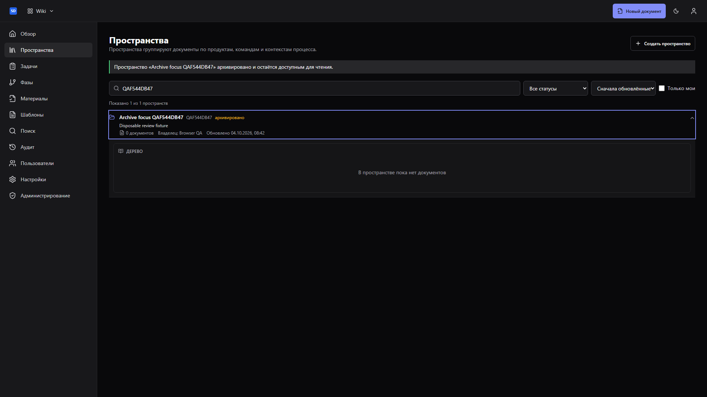
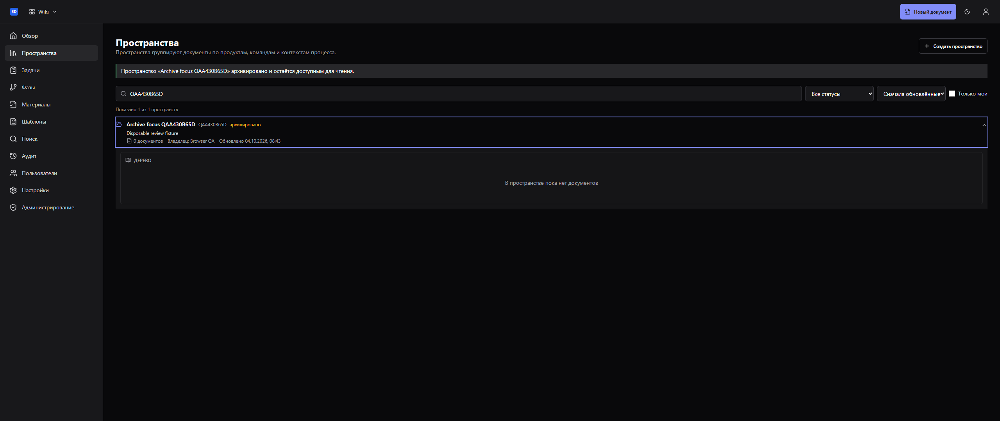
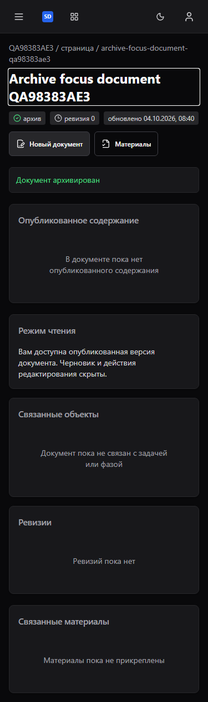
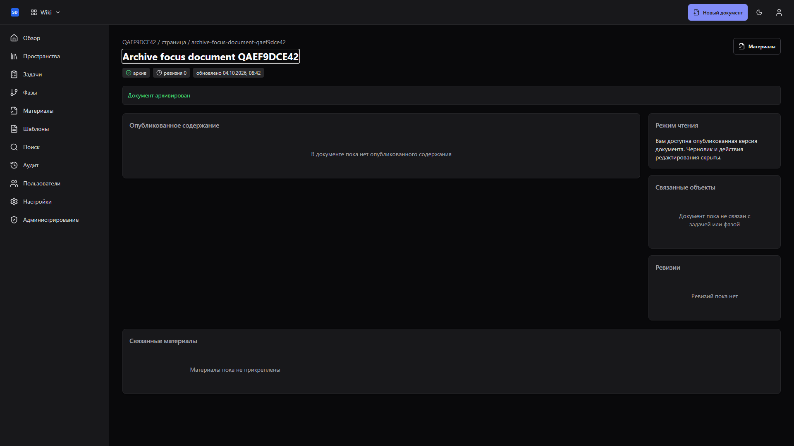
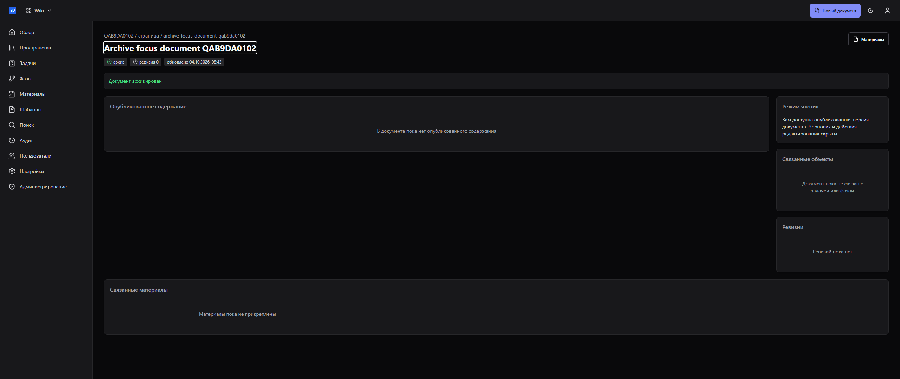

# Архивирование и возврат фокуса — 4 октября 2026

Production UI с реальными Central Auth, API и PostgreSQL проверен в отдельном
временном Compose-проекте. Архивируются только созданные проверкой документы и
пространства; runtime приложения не меняется. Подмена ответов API не используется.

24 сценария: пространство и документ × 375/768/1920/2560 px × dark/gray/light.
Каждый проверяет Cancel/Escape и исходную кнопку, клавиатурный trap, границы
диалога, pending на реальной блокировке PostgreSQL, запрет Escape во время запроса,
POST 200, повторный GET archived, исчезновение кнопки и новую точку фокуса.
После успешного архивирования фокус стоит на строке пространства или h1 документа.
Compose завершён штатно; exit cleanup 0.

180 frontend-тестов (30 на двух страницах), typecheck/lint/format/build,
OpenAPI drift/compatibility, packed consumer и effective themes прошли.
Две новые регрессии не проходят на исходном коде. Три браузерных движка:
21 fixture-тест прошёл, 6 opt-in live-тестов пропущены и не считаются пройденными.
Эта проверка архивирования не заменяет полную live-приёмку Wiki или всей поставки.

Версии, точное проверенное Git-дерево, Base SHA, image ID и fingerprints:
[evidence.json](evidence.json).

## Пространство, 375 px

## Пространство, 1920 px

## Пространство, 2560 px

## Документ, 375 px

## Документ, 1920 px

## Документ, 2560 px

